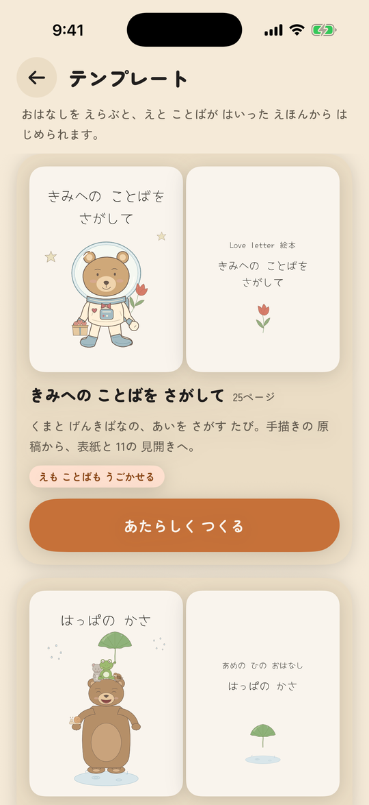
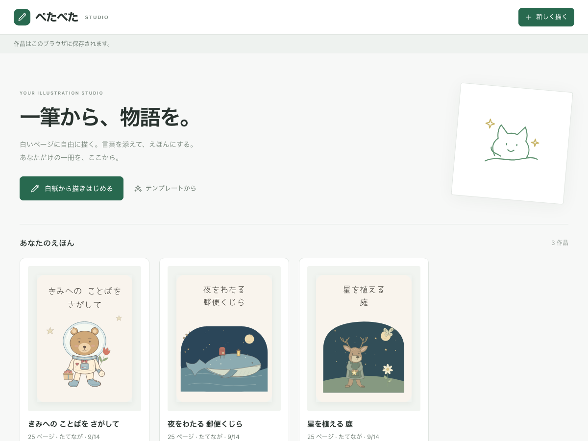
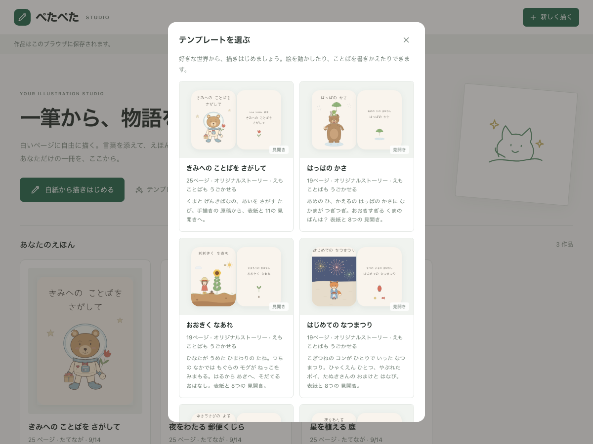
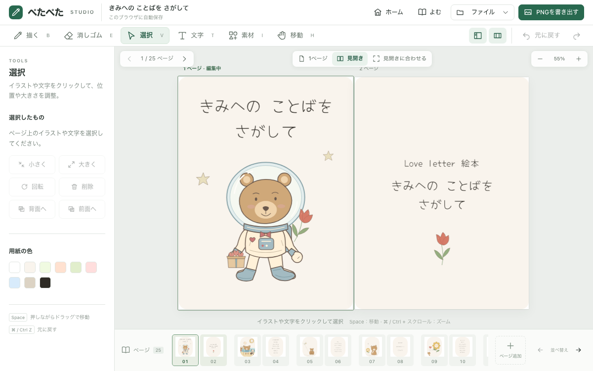
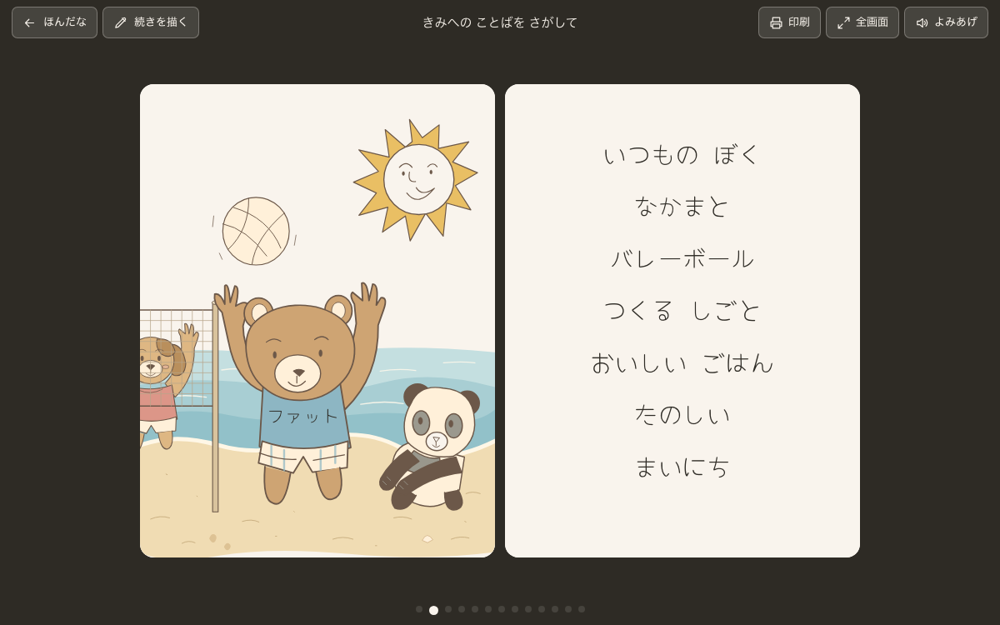
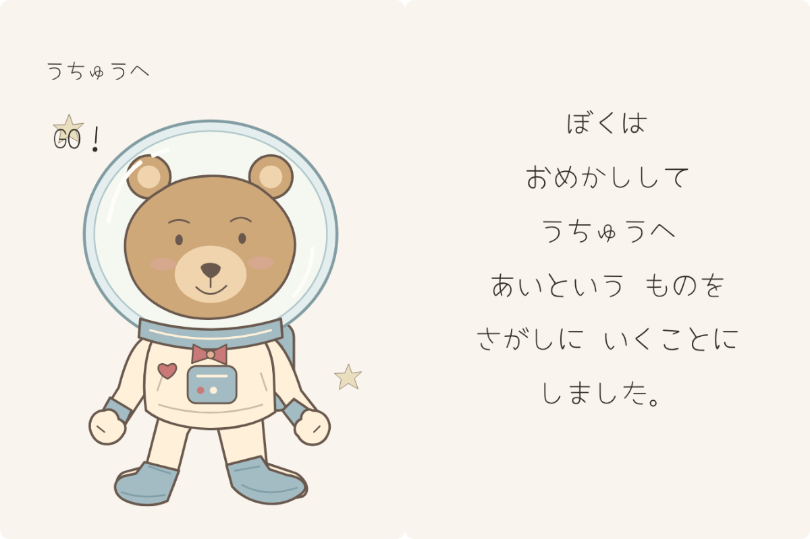
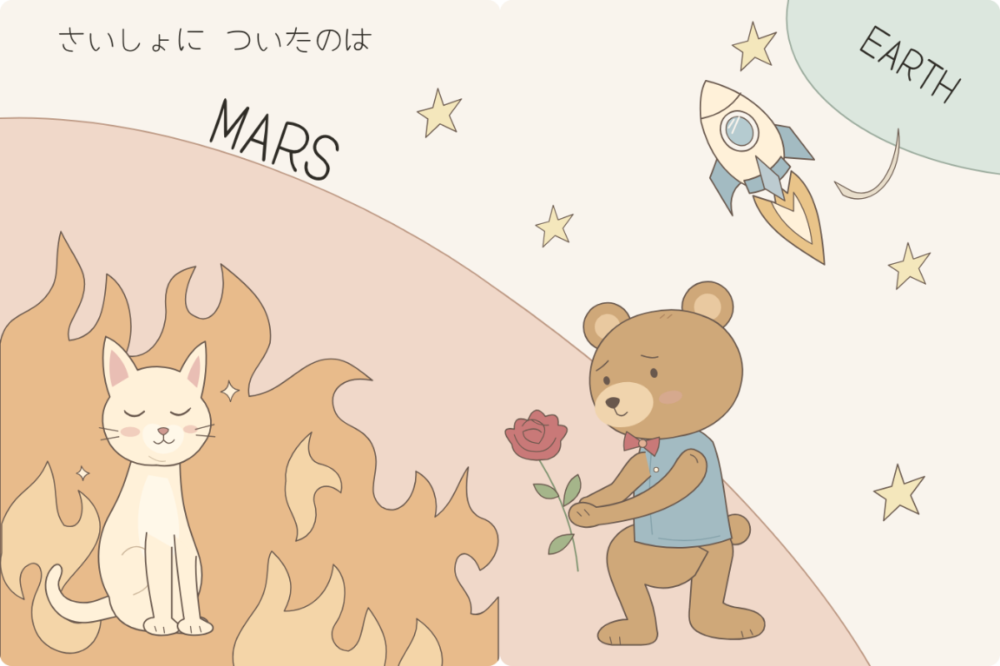
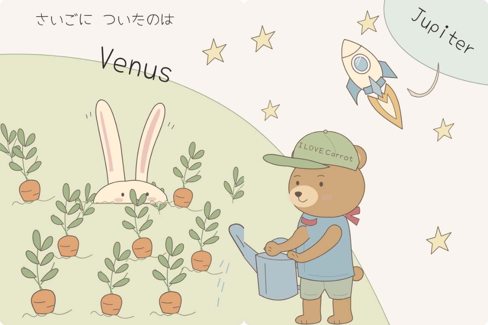
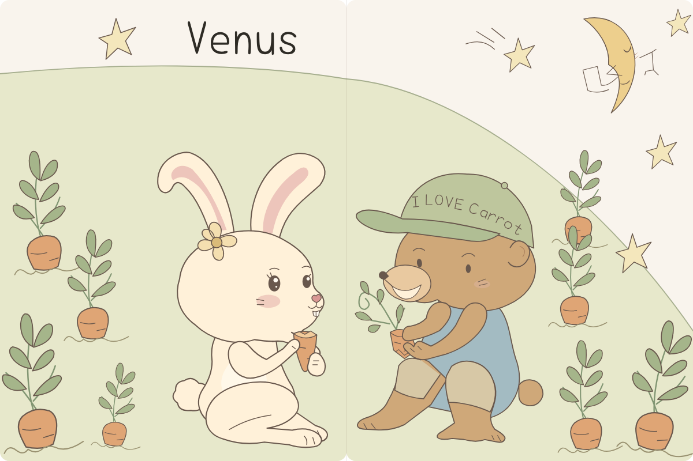
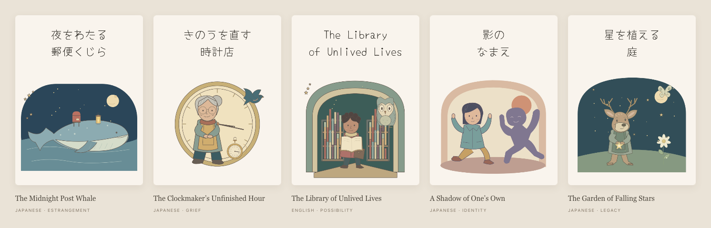

<p align="center">
  
</p>

<h1 align="center">ぺたぺた</h1>

<p align="center">
  <b>おやこで つくる えほん</b><br>
  A picture-book maker for small children and the grown-ups reading with them.<br>
  iPhone · iPad · Web · Japanese UI · one Kotlin Multiplatform core under SwiftUI and React
</p>

<p align="center">
  
  
  
  
  
  
</p>

<p align="center">
  
</p>

<p align="center">
  
  
</p>

<p align="center"><sub>
  Shelf · stories · はる (stick) · もじ (words) · send to family · grandma's reply screen · reading spread · iPad make and read
</sub></p>

<p align="center">
  
  
</p>

<p align="center">
  
  
</p>

<p align="center"><sub>
  The web shelf, the story picker, the studio and the reader: the same books, on the phone or in the browser
</sub></p>

<p align="center">
  
  
</p>

<p align="center">
  
  
</p>

<p align="center"><sub>
  Four spreads of きみへの ことばを さがして, a hand-drawn storyboard bound as a book document; every character is a piece the child can move
</sub></p>

## What it does

- **Start on a blank white page, or pick a story.** The shelf on the phone and on the web opens the same two doors: まっしろな ページから gives one blank page with the brush ready, テンプレートから lists ten stories, each previewed as its opening spread, and copies the one you choose onto your shelf with every picture movable and every word editable.
- **Then stick, draw or write.** Parts go on the page, a finger draws, words are typed. Three modes, never overlapping, so a small hand cannot wreck a page by accident.
- **Words in six faces**: てがき, まるまる, えほん, ぽっぷ, マーカー, ふとまる. One ships in the app; the others download on first use. Japanese books get a furigana field in おとな mode.
- **Reading is a two-page spread** with a drag-driven page fold, read-aloud, and おやすみ mode that turns pages by itself at bedtime.
- **Family can join in.** Send the book as an `.ehon` file or a printable PDF. A grandparent can hold a button to leave a voice reply on a page, and it plays back during reading.
- **Signed in, the shelf follows you.** Apple or Google sign-in on the phone or in the browser, both behind the gear on the shelf. Books sync page by page; one device edits a book at a time and the other reads along. A read-only guest link needs no account, and the browser can be signed in by scanning a QR code with the phone.
- **こども / おとな** switch: bigger targets and fewer knobs for the child; layering, furigana and page reordering for the adult.
- **iPad**: hold it upright to make, turn it sideways to read.
- Japanese first. The UI falls back to English on other devices.
- **A book is one document.** Pictures travel inside the `.ehon` file as SVG, so a person or a language model can write or rework a whole illustrated book, and every piece stays movable and every caption editable on the phone and the web alike. The contract is [`docs/EHON_FORMAT.md`](docs/EHON_FORMAT.md).
- **Story templates are storyboards bound as books.** Each story in `shared/templates/` is a `story.json` with its SVG pieces, assembled at build time into the document the shelf copies. きみへの ことばを さがして is the worked example: a cover, a title page, twenty-two storyboard pages picture-left words-right, and a back cover, drawn from the author's pencil sketches with every character a piece the child can move. Four originals for small children are bound the same way: はっぱの かさ (a frog's leaf umbrella fills with friends on a rainy day), おおきく なあれ (a girl grows a sunflower while a mole guards its roots), はじめての なつまつり (a fox cub's first summer festival) and ゆきうさぎの よる (a snow rabbit that comes alive under the moon). Five 25-page originals for older readers, one of them in English, follow in [Story templates](#story-templates).
- **On the web**, the same core draws in a React studio: a canvas-first desk that shows illustrated books as facing pages, brush, eraser, words with furigana, the book's own pieces as materials, PNG uploads that become parts on every device, and a reader one click away with read-aloud, full screen and printing that lays every spread on its own sheet. With a Firebase project configured it is for signed-in grown-ups, with a landing page in front; a checkout without one is a complete local book maker.

## How it is built

A shared Kotlin core owns the document, the editor semantics and the layout, and emits a **pure-data scene graph**. Each platform has one thin painter that walks it. The screen, the 2048 px share image and the 300 dpi PDF are the same tree at different scales, so what a child sees is structurally what prints.

```
shared/            Kotlin Multiplatform: model, parts catalog, SVG parser, scene graph, EditorController, codec, strings
shared/templates/  Story templates as documents: a story.json and its SVG pieces per story
iosApp/            SwiftUI app + CoreGraphics painter (iPhone and iPad)
painter-compose/   Compose painter, kept compiling on the JVM so the core always has two consumers
web/               React studio, shelf and reader over the generated Kotlin/JS core and its Canvas2D painter
backend/           Firestore rules, Tokyo functions, the assets worker and their emulator tests
docs/DECISIONS.md  Why things are the way they are
docs/EHON_FORMAT.md  The book document a model or a person writes: pages, words, SVG art
docs/WEB_BACKEND_PLAN.md  The web studio and backend, phase by phase (Phases 0–2 implemented)
```

Mutation happens only in Kotlin. Swift sends intents and repaints; see the decision record for the interop lessons behind that rule.

## Build and run

Requirements: Xcode 26, a JDK 21 (`brew install openjdk@21`), Google Chrome for the shared browser tests, and [xcodegen](https://github.com/yonaskolb/XcodeGen) (`brew install xcodegen`). The Xcode project is generated from `iosApp/project.yml` and is not committed.

```sh
make test                       # shared tests on JVM, Node and Chrome + Compose painter
make run SIM='iPhone 17'        # build, install and launch on a simulator
make check SIM='iPhone 17'      # everything, including the iOS painter tests
make shots                      # screenshot every screen into build/shots/
```

For a real device, set your team once and regenerate the project:

```sh
export EHON_DEVELOPMENT_TEAM=ABCDE12345
make xcodeproj && open iosApp/Ehon.xcodeproj
```

Device builds link the Kotlin framework in Release, so the first one takes a few minutes longer.

The web harness additionally needs Node 22.12+ and pnpm 11.22:

```sh
make web                        # build the Kotlin/JS package and open Vite on localhost:5173
make web-build                  # generate core, check TypeScript and build web/dist/
cd web && pnpm exec playwright install chromium  # once, for browser checks
cd .. && make web-test           # browser interactions and six painter snapshots
```

Open `http://localhost:5173/` for the shelf, `/app` to draw on a blank page, or
`/app?template=doc-love-letter` to try a story without keeping it. Illustrated books open as
facing pages; the view bar floats over the desk, and the tool panel and page strip fold away so
the pages get the screen. **よむ** opens the reader, whose **印刷** prints the whole book one spread
per landscape sheet or saves it as a PDF. `.ehon` files open and save from the File menu. See
[`web/README.md`](web/README.md) for the facade contract.

### Story templates

A template is a folder in `shared/templates/<story>/`: a `story.json` that is the book with each
`art` entry pointing at a file, and the SVG pieces in `art/`. Gradle assembles every story into a
portable document plus an `index.json` in `shared/build/templates/`, which the checker reads and
the clients fetch. Nothing is compiled into the apps: the documents are published to the assets
bucket behind the Worker, the phone and the web read the index at runtime and keep a copy, so a new
or corrected story reaches every device without a release (decision #60). While developing, nothing
is fetched: `make web` reads the assembled copy from the dev server and a Debug iOS build carries it
in its bundle, so the templates screen works offline and without a cloud configuration; release
builds fetch the published index (decision #61).

```sh
make web-core                                   # assembles every story on the way
cd web && pnpm ehon-check ../shared/build/templates/doc-love-letter.ehon.json
make templates-upload                           # publish to ehon-assets-dev (BUCKET=ehon-assets-prod for prod)
```

Bind a new story the way a storyboard is drawn: a cover, a title page, spreads with the picture on
the left page and the words on the right, a back cover with the colophon; narration written in the
margins stays off the page. The rules are in [`docs/EHON_FORMAT.md`](docs/EHON_FORMAT.md) and the
worked example in [`shared/templates/love-letter/README.md`](shared/templates/love-letter/README.md).

Five further originals follow Love Letter's full **25-page** format, each with eleven spreads,
two panoramic illustrations, movable SVG characters and props, and editable words. These stories
also invite older readers to explore grief, identity, regret and the things we hope to leave behind.



| Template | Language | Story |
| --- | --- | --- |
| [夜をわたる 郵便くじら — The Midnight Post Whale](shared/templates/midnight-whale/README.md) | Japanese | A voyage through unsent words; an apology that leaves room for an answer. |
| [きのうを直す 時計店 — The Clockmaker's Unfinished Hour](shared/templates/clockwork-orchard/README.md) | Japanese | An elderly clockmaker stops the town after losing her partner, then makes room for the next minute. |
| [The Library of Unlived Lives](shared/templates/unlived-library/README.md) | **English** | At forty, Mara opens the lives she never chose and discovers the unwritten pages of her own. |
| [影の なまえ — A Shadow of One's Own](shared/templates/shadow-name/README.md) | Japanese | A shadow chooses a name and its own movement; companionship learns to include independence. |
| [星を植える 庭 — The Garden of Falling Stars](shared/templates/star-garden/README.md) | Japanese | A gardener hoping to leave his name in the sky learns to tend the flower that actually grows. |

The English book sets `contentLocale: "en"`, including English story text, artwork names and
colophon fields. Its read-aloud language follows that locale. Preview any book at
`/app?template=doc-<folder-name>` after assembling the templates. New folders enter the shared
web and iOS catalog automatically when their documents and index are published.

## Status

Working prototype, in TestFlight for closed testing. Not on the App Store. Books live on the device; signed in, they sync between the phone and the web. Phases 0–2 of [`docs/WEB_BACKEND_PLAN.md`](docs/WEB_BACKEND_PLAN.md) are implemented: codec v4 (still reads v1 to v3) with SVG art inside the document, ten story templates written as documents and published to the assets bucket, the Kotlin/JS core, a web shelf, a canvas-first studio with facing pages, a reader that prints, accounts with book sync on iOS and web, read-only guest links, PNG uploads that become parts on every device, sliced web fonts and Lighthouse byte budgets in CI. Everything also runs against the Firebase emulators. The dev environment is deployed: Firebase project, Tokyo functions, R2 bucket behind the assets Worker, and the web app on Cloudflare Pages behind a sign-in landing page with a QR hand-off from the phone app. App Check is registered for the web; registering the iOS app is the remaining provisioning step before voice backup and guest links work from the phone against the live project. Advanced layered raster painting, AI, billing and packs remain in Phases 3–4.

## License

Code is released under the [MIT License](LICENSE).

The fonts are not mine. Yomogi, Zen Maru Gothic and Caprasimo ship in the app, and Kiwi Maru, Hachi Maru Pop, Yusei Magic and RocknRoll One download on demand. All are Google Fonts releases under the [SIL Open Font License 1.1](https://openfontlicense.org); the licence texts travel with the bundled fonts in `iosApp/Ehon/Fonts/`.
