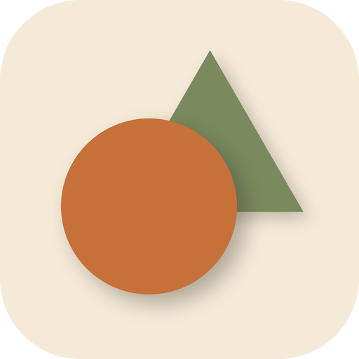
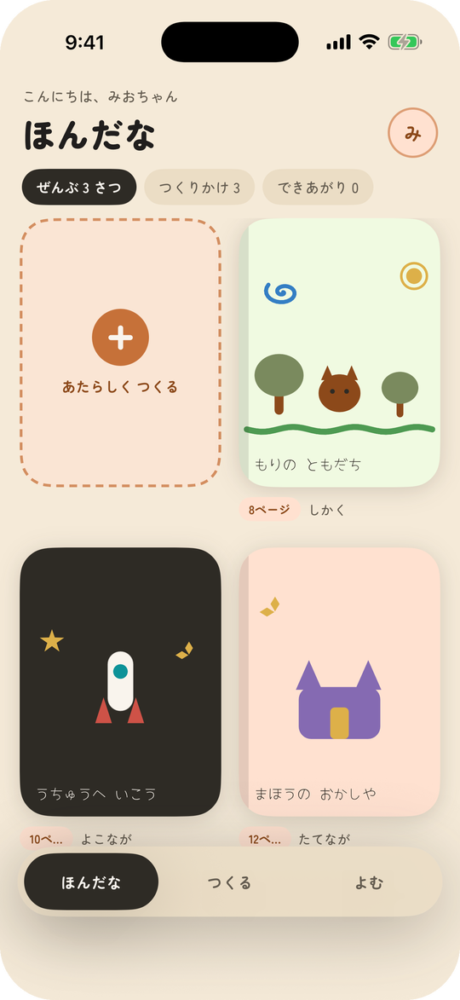
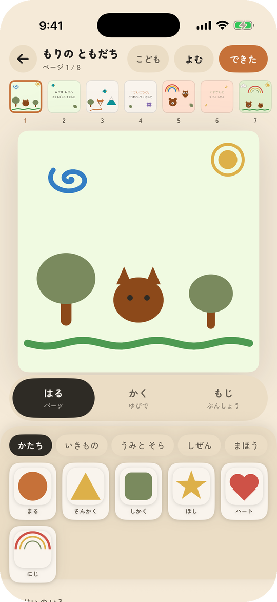
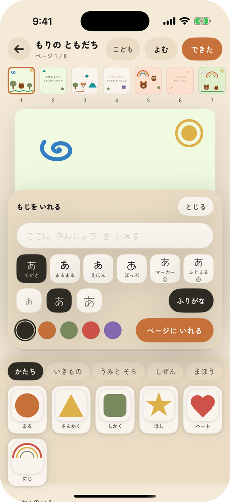
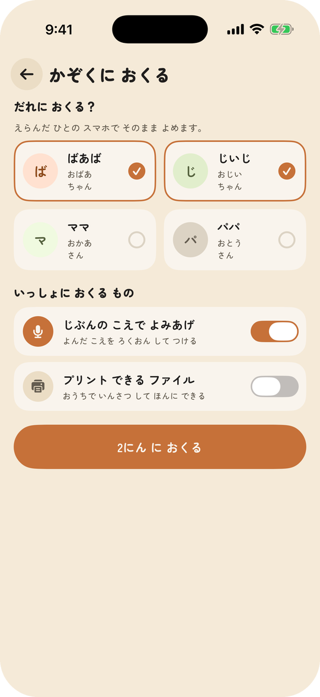
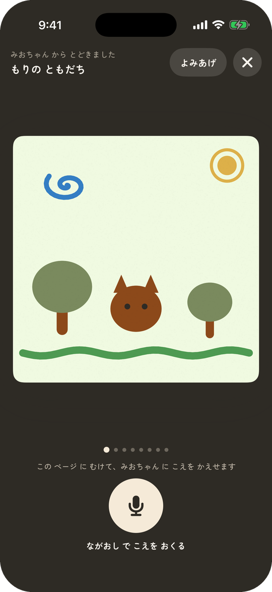
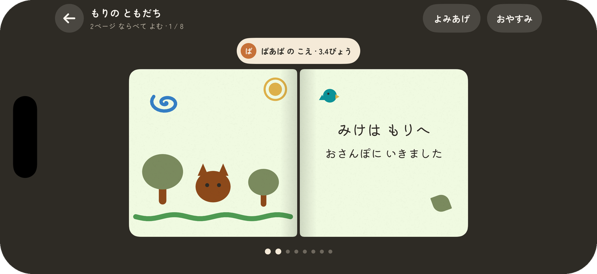
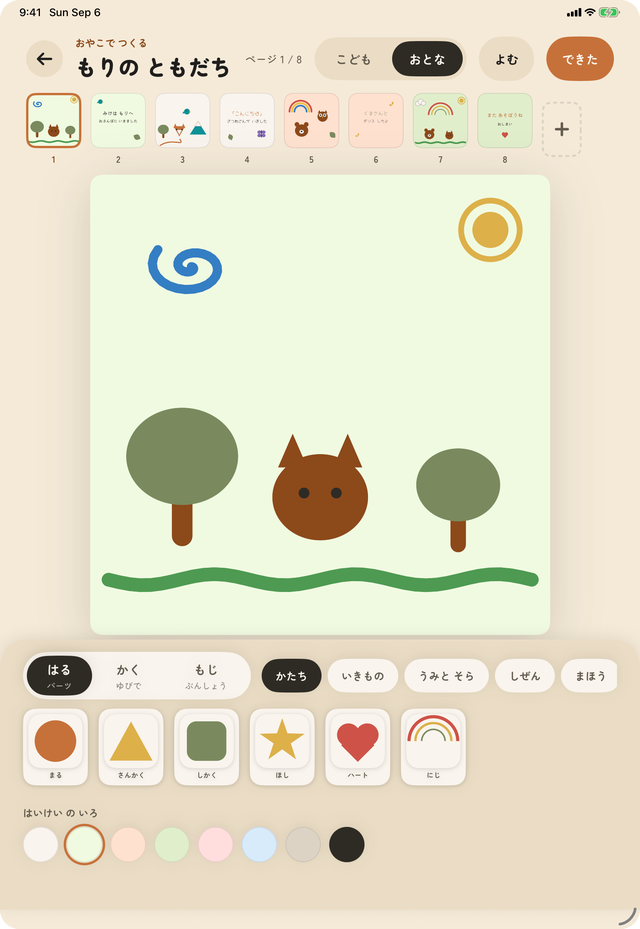
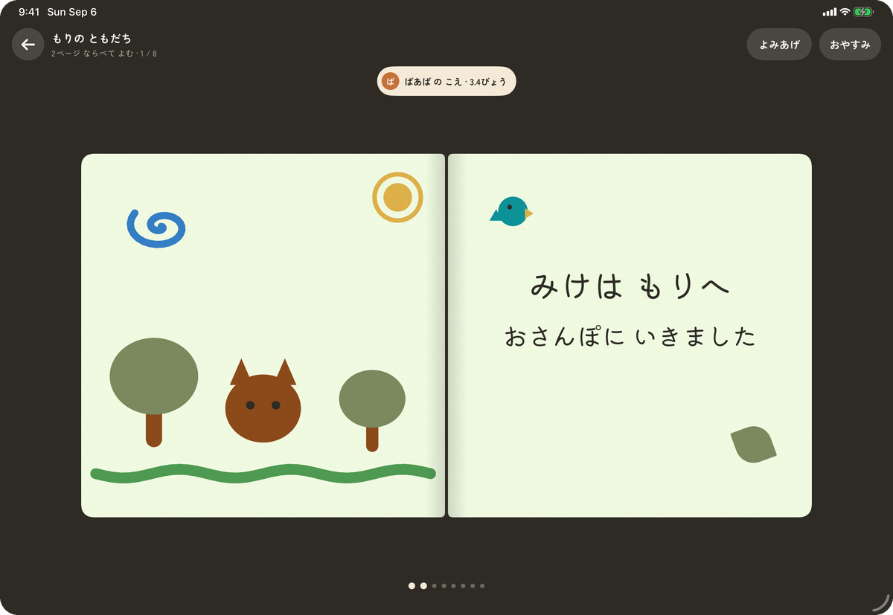

<p align="center">
  
</p>

<h1 align="center">ぺたぺた</h1>

<p align="center">
  <b>おやこで つくる えほん</b><br>
  A picture-book maker for small children and the grown-ups reading with them.<br>
  iPhone · iPad · Japanese UI · Kotlin Multiplatform core + SwiftUI
</p>

<p align="center">
  
  
  
  
  
</p>

<p align="center">
  
</p>

<p align="center">
  
  
</p>

<p align="center"><sub>
  Shelf · はる (stick) · もじ (words) · send to family · grandma's reply screen · reading spread · iPad make and read
</sub></p>

## What it does

- **Start from a template**, then stick parts on the page, draw with a finger, or write words. Three modes, never overlapping, so a small hand cannot wreck a page by accident.
- **Words in six faces**: てがき, まるまる, えほん, ぽっぷ, マーカー, ふとまる. One ships in the app; the others download on first use. Japanese books get a furigana field in おとな mode.
- **Reading is a two-page spread** with a drag-driven page fold, read-aloud, and おやすみ mode that turns pages by itself at bedtime.
- **Family can join in.** Send the book as an `.ehon` file or a printable PDF. A grandparent can hold a button to leave a voice reply on a page, and it plays back during reading.
- **こども / おとな** switch: bigger targets and fewer knobs for the child; layering, furigana and page reordering for the adult.
- **iPad**: hold it upright to make, turn it sideways to read.
- Japanese first. The UI falls back to English on other devices.

## How it is built

A shared Kotlin core owns the document, the editor semantics and the layout, and emits a **pure-data scene graph**. Each platform has one thin painter that walks it. The screen, the 2048 px share image and the 300 dpi PDF are the same tree at different scales, so what a child sees is structurally what prints.

```
shared/            Kotlin Multiplatform: model, parts catalog, scene graph, EditorController, codec, strings
iosApp/            SwiftUI app + CoreGraphics painter (iPhone and iPad)
painter-compose/   Compose painter, kept compiling on the JVM so the core always has two consumers
docs/DECISIONS.md  Why things are the way they are
```

Mutation happens only in Kotlin. Swift sends intents and repaints; see the decision record for the interop lessons behind that rule.

## Build and run

Requirements: Xcode 26, a JDK 21 (`brew install openjdk@21`) and [xcodegen](https://github.com/yonaskolb/XcodeGen) (`brew install xcodegen`). The Xcode project is generated from `iosApp/project.yml` and is not committed.

```sh
make test                       # shared tests + Compose painter, JVM only
make run SIM='iPhone 17'        # build, install and launch on a simulator
make check SIM='iPhone 17'      # everything, including the iOS painter tests
make shots                      # screenshot every screen into build/shots/
```

For a real device, set your team once and regenerate the project:

```sh
export EHON_DEVELOPMENT_TEAM=ABCDE12345
make xcodeproj && open iosApp/Ehon.xcodeproj
```

Device builds link the Kotlin framework in Release, so the first one takes a few minutes longer.

## Status

Working prototype heading into closed testing. Not on the App Store. The family "open a link, no app needed" flow still needs a web page and a backend; today the reply recorder lives inside the app.

## License

Code is released under the [MIT License](LICENSE).

The fonts are not mine. Yomogi, Zen Maru Gothic and Caprasimo ship in the app, and Kiwi Maru, Hachi Maru Pop, Yusei Magic and RocknRoll One download on demand. All are Google Fonts releases under the [SIL Open Font License 1.1](https://openfontlicense.org); the licence texts travel with the bundled fonts in `iosApp/Ehon/Fonts/`.
